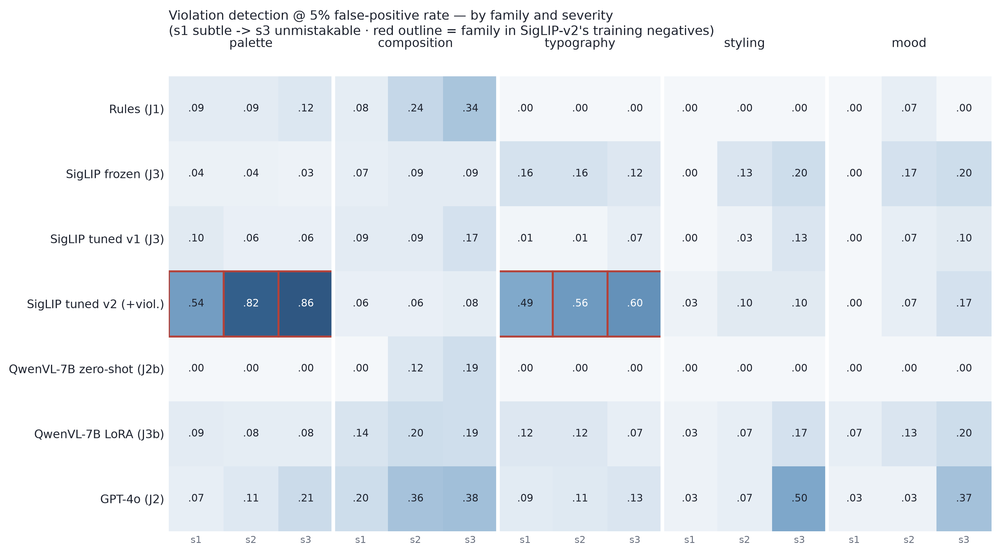

# judgebench

**Which judges survive optimization pressure?** A study of the exploitability of
image-generation QC judges (rule stacks, frozen VLM APIs, open VLMs, trained
reward models) under matched optimization pressure, anchored in brand fidelity
(rhode, with Glossier and ILIA as in-category hard negatives). Phase 1 measures
each judge's blind spots on a constructed ground-truth exam. Phase 2 attacks the
judges with three optimizers of increasing access (best-of-N selection, DPO
preference training, SRPO gradient training) and checks whether the exploits
land exactly where the report card predicted. They do.

## Headline findings

- **Blind spots are universal and measurable.** On 2,622 constructed
  ground-truth test items, no judge does all three jobs (brand ID, violation
  detection, ordinal ranking). Severity-1 brand violations are near-invisible to
  every judge (detection at most 10 percent at 5 percent FPR); the best judge
  catches at most half of severity-3.
- **Exploit severity scales with optimizer access.** Hack-gap on the
  SigLIP-tuned judge: selection/BoN 0.13, preference/DPO 0.11, gradient/SRPO
  0.45. Choose-only < learn-preferences << direct-gradients.
- **Selection (BoN):** the Gao-style inverted-U appears. SigLIP-tuned's
  held-out-panel quality peaks at N=64 and declines through N=512 while its own
  score keeps rising; QwenVL-LoRA peaks at N=16 and goes negative by N=256.
  GPT-4o and QwenVL zero-shot show no decline at our depth.
- **Gradient (SRPO on FLUX.1-dev):** the trained SigLIP judge shatters. Target
  score +0.36 while two independent judges saw brand quality decline; reward
  leaked +0.26 onto unrelated control prompts (golden retrievers scored as more
  on-brand).
- **The clean control:** the identical gradient attack on the QwenVL-7B LoRA
  judge fails. Target moved +0.012 (roughly 30x smaller than SigLIP's +0.36),
  zero control leakage. Same attack, same generator, same pressure, opposite
  outcome.
- **Mechanistic peek:** the SigLIP exploit is a single embedding direction.
  Projecting it out collapses hacked-image scores from 0.84 to 0.54 while
  genuine brand images barely move (0.48 to 0.49).
- **Hardening:** retraining with the SRPO hacks as negatives fully defeats the
  seen attack (0.84 to 0.00, brand AUC intact at 0.997) but only dampens the
  unseen DPO attack (0.47 to 0.28). You can harden against what you have seen;
  novel attacks retain partial traction.

**Conclusion: judge choice is a security-architecture decision.** Different
judge types expose different attack surfaces: a differentiable embedding
similarity offers gradient descent a smooth low-dimensional target; a 7B
generative VLM behind a P("yes") readout does not; an API judge faces only
selection pressure.

## Judge roster (six judges, two matched tuning pairs)

| ID | Judge | Type |
|---|---|---|
| J1 | Rules | hand-written brand-guideline feature checks (CPU) |
| J2 | GPT-4o + Gemini 2.5 Pro | frozen API VLM panel |
| J2b | QwenVL-7B zero-shot | open VLM, prompt plus reference board |
| J3b | QwenVL-7B LoRA | same weights, LoRA-tuned on binary brand labels |
| J3 | SigLIP frozen | embedding cosine to brand centroid |
| J3 | SigLIP contrastive-tuned | same backbone, SupCon-tuned (v1; v2 adds violation negatives) |

## Phase 1: the exam

| Instrument | Question it asks |
|---|---|
| Real positives vs competitor creatives | can you tell the brand apart at all? |
| Same, with competitor logos masked | or are you just reading the wordmark? |
| Programmatic corruptions (5 families x 3 severities) | do you notice deliberate brand violations? |
| Brand-LoRA dial (6 adapter scales x prompts x seeds) | can you rank degrees of brand-ness? |
| Temporal holdout (newest campaign, fully held out) | did you learn style or memorize products? |

Ground truth by construction: corruptions are parameterized image operations
(severity is the parameter), the dial is an adapter scale, splits are
cluster-level with a certified 0.0 percent near-twin leak rate.

### Report card (test split only; fits on train/val)

| Judge | Brand AUC | Logo delta | Mean det@5%FPR | Dial rho | ECE |
|---|---|---|---|---|---|
| Rules (J1) | 0.59 | 0.04 | 0.07 | 0.01 | 0.03 |
| SigLIP frozen (J3) | 0.73 | 0.00 | 0.10 | -0.03 | 0.07 |
| SigLIP tuned v1 (J3) | **0.99** | 0.00 | 0.07 | 0.24 | 0.06 |
| SigLIP tuned v2 (+violation negs) | 0.98 | 0.01 | **0.30** | 0.45 | 0.06 |
| QwenVL-7B zero-shot (J2b) | 0.98 | **0.31** | 0.02 | **0.94** | 0.20 |
| QwenVL-7B LoRA (J3b) | 0.98 | 0.05 | 0.12 | 0.16 | **0.03** |
| GPT-4o (J2) | 0.82 | 0.04 | 0.18 | 0.65 | 0.17 |
| Gemini 2.5 Pro (J2) | *scoring in progress (daily API quota)* | | | | |



What the table means, in brief:

- **QwenVL zero-shot is a name-tag reader.** Brand AUC collapses 0.98 to 0.67
  when logos are masked, yet it is the roster's best ranker (dial rho 0.94).
- **Fine-tuning reallocates capability; it does not add it.** LoRA-tuning the
  same QwenVL cures the logo shortcut (delta 0.31 to 0.05) and destroys its
  ranking ability (0.94 to 0.16). SigLIP-tuning buys near-perfect brand ID and
  nothing else.
- **Violation training memorizes the attack, not the concept.** SigLIP-v2 adds
  810 corruption negatives (palette and typography only): detection explodes on
  those families (0.06 to 0.86) and moves zero on held-out families. You cannot
  enumerate your way to a safe judge.
- **Everyone is near-blind to subtle (s1) violations**: the top row of every
  optimizer's gradient, and Phase 2's predicted exploit surface.

## Phase 2: exploitability leaderboard

Three attack arms, all on the same brand and matched evaluation protocol.
BoN: 6,112 base FLUX.1-dev images, bootstrap best-of-N per judge, winners
re-scored by a held-out panel. DPO: SDXL Diffusion-DPO-LoRA on pairs harvested
from the BoN pool. SRPO: 200 steps of direct gradient training on FLUX.1-dev
with the judge as the differentiable reward.

| Judge | BoN peak-minus-final (gold) | DPO hack-gap | SRPO hack-gap |
|---|---|---|---|
| SigLIP frozen | 0.08 | not run | not run |
| SigLIP tuned v1 | 0.13 | **0.11** (target +0.10) | **0.45** (target +0.36, control leak +0.26) |
| SigLIP tuned v2 | 0.00 | not run | not run |
| QwenVL zero-shot | 0.00 | not run | not run |
| QwenVL LoRA | 0.17 | not run | 0.16 clean-gap, target **+0.01** (null; leak -0.00) |
| GPT-4o | 0.00 | not run | not attackable (no gradients) |

Honest scoping: the DPO arm was run against SigLIP-tuned v1 only (the judge the
other two arms also target), so the three-arm ordering is measured on a single
judge. SRPO was run against the two judges with open differentiable weights;
API judges structurally face only the selection arm. Full numbers:
`eval/results/leaderboard.json`, `eval/results/bon_curves.json`,
`eval/results/srpo_qwen.json`.

### The gradient control: SigLIP shatters, QwenVL holds

Same 200-step SRPO attack, same generator, same prompts, seeds, and budget:

| Attacked judge | Target brand score | Independent judges | Control leakage |
|---|---|---|---|
| SigLIP tuned v1 | 0.48 to 0.84 (**+0.36**) | frozen -0.03, GPT-4o -0.09 | **+0.26** |
| QwenVL-7B LoRA | 0.358 to 0.370 (**+0.012**) | frozen -0.18, tuned-v1 -0.11 | -0.001 |

The optimizer did not learn to make better brand creatives; against SigLIP it
learned to exploit that specific reward (pink palette and wordmark features
injected into every image, including golden retrievers). Against the QwenVL
judge it found nothing: where it perturbed hardest it merely broke the image,
and the target judge correctly scored the break near 0. Details and caveats:
`docs/srpo_qwen_findings.md`.

**Mechanistic peek** (`eval/results/mechanistic_peek.json`): the SigLIP exploit
rides one embedding direction (cosine 0.37 to the brand centroid). Projecting
that single direction out drops hacked images 0.843 to 0.535 and leaves genuine
brand images essentially unchanged (0.479 to 0.489).

**Hardening round** (`eval/results/hardening.json`): SigLIP-tuned-v3 = v1
recipe plus the SRPO hacks as a third negative class. Seen attack fully
rejected (0.843 to 0.000) with brand recognition intact (real-rhode test AUC
0.997). Unseen DPO attack only dampened (0.470 to 0.276). Single seed; a fresh
SRPO re-attack against v3 is noted as future work.

## Repo layout

```
data/     scrape manifests, dedupe/clustering, splits (images not committed)
testbed/  corruption generators, LoRA dial, BoN pool, DPO and SRPO attack code
judges/   j1 rules, j2 API VLMs, j3 SigLIP fits, pod jobs (SigLIP tune, Qwen LoRA)
eval/     testset index, scoring, report card, BoN curves, leaderboard,
          mechanistic peek, hardening; results JSONs in eval/results/
docs/     case_study.md (Findings 1-13), srpo_qwen_findings.md, figures,
          hack_gallery.html
```

Code, configs, prompts, manifests, and results JSONs are committed. Raw images,
model weights, and embeddings are not.

## Data policy

Raw brand images are third-party copyrighted material and are **not** in this
repo. Manifests carry URLs, hashes, extracted features, scores, and full
construction records; every derived number regenerates from committed
artifacts. Generated FLUX/SDXL outputs are excluded for size. The hack gallery
(`docs/hack_gallery.html`) embeds a small set of our own generated exemplars.

## Trained model weights

The two SRPO-attacked generator checkpoints are on Hugging Face (currently
private): `Gupta28/judgebench-srpo-siglip-ckpt200` and
`Gupta28/judgebench-srpo-qwen-ckpt200`.

## Reproduce

API keys go in `.env` at the repo root: `OPENAI_API_KEY`, `GEMINI_API_KEY`
(used by `judges/j2_vlm.py`).

Pipeline order (local unless noted; GPU steps ran on rented pods, launch
scripts committed):

1. **Scrape**: `data/scrape/download_images.py`, then `data/dedupe.py` and
   `data/make_splits.py` (hybrid phash + SigLIP clustering, leak-certified
   splits).
2. **Test set**: `testbed/corruptions/generate.py` (programmatic corruptions),
   `testbed/corruptions/logo_mask*.py` (masked instrument),
   `testbed/dial/pod_sweep.py` (LoRA dial, GPU), then `eval/build_index.py`.
3. **Judges**: `judges/j1_rules.py`, `judges/j2_vlm.py`, `judges/j3_frozen.py`;
   tuned judges via `judges/pod_judges.py` (GPU).
4. **Report card**: `eval/score_judges.py` writes
   `eval/results/report_card_v1.json`; `eval/make_heatmap.py` renders the
   figure.
5. **Attacks**: `testbed/bon/` (BoN pool and scoring), `testbed/dpo/` (pair
   harvest and DPO eval), `testbed/srpo/` (SRPO launch scripts and reward
   adapters, GPU). Aggregation: `eval/bon_curves.py`, `eval/leaderboard.py`,
   `eval/mechanistic_peek.py`, `eval/train_hardened_local.py` and
   `eval/finish_hardening.py`.

Approximate per-judge production cost, measured on the 2,622-image Phase 1 run:
rules ~free (CPU); SigLIP under $0.10/1K images; QwenVL zero-shot ~$0.9/1K
(A40); QwenVL LoRA ~$0.1/1K; GPT-4o ~$6.3/1K ($16.60 actual for the full run);
Gemini 2.5 Pro ~$4.2/1K (tier-1 daily quota applies).

## Limitations

- Single anchor brand and single domain (beauty-brand static creatives); the
  exploitability ordering should be re-tested across domains before
  generalizing.
- Single seed per tune and per attack run; the BoN deep arm covers 8 prompts.
- The BoN "gold" signal is a panel of the other judges, all of which Phase 1
  shows are partially blind; same-family panel members flatter their siblings
  (measured directly: a strict panel turns one apparent gain flat).
- Corruption families are a sample of violation space, not an enumeration; the
  dial confounds brand-ness with coherence at high adapter scale (spot-checked).
- The QwenVL gradient-robustness result is a lower bound at matched pressure
  (the exact budget that broke SigLIP), not proof of unconditional robustness.
- Gemini report-card scoring is partial (API quota); the SRPO-Qwen arm's
  external GPT-4o cross-check is deferred, though two independent embedding
  judges and the attacked judge itself already agree.

Rigor process (leak certification, pre-registered ablations, audit trails for
every instrument) is logged in `docs/case_study.md`, Findings 1 through 13.

*AI involvement: this project was built with heavy use of Claude (Anthropic)
for code and analysis; all results were verified by the author.*
